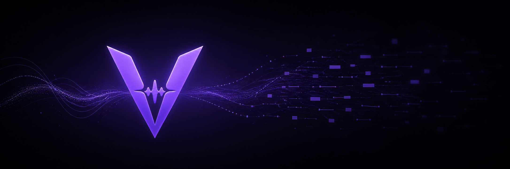

# Veskri



**A fast, privacy-minded desktop dictation app for Windows, macOS, and Linux.**

Hold a shortcut, speak naturally, and have your text copied or pasted into the app you are already using.

[Features](#features) · [Getting started](#getting-started) · [Privacy](#privacy) · [Development](#development) · [Releases](#releases)

## Why Veskri?

Veskri is an open-source desktop app for fast dictation on Windows, macOS, and Linux. It pairs a focused, Linear-inspired settings experience with native Rust audio recording and Groq's Whisper transcription models.

The app runs quietly in the system tray, works from any application, and keeps the workflow intentionally simple: dictate, transcribe, continue writing.

## Features

- Global, configurable shortcut — defaults to `Ctrl + Shift + Space`
- Hold-to-talk and toggle dictation modes
- Native microphone selection and local microphone-level check
- Groq Whisper Large v3 and Large v3 Turbo support
- Automatic language detection, with manual language selection when needed
- Copy-only or immediate auto-paste output
- Optional voice commands in English and German, such as “new paragraph”, “comma”, “neuer Absatz”, and “Punkt”
- Literal and polished text modes
- Personal dictionary for names, product terms, and preferred spellings
- Local transcript history with pinning, editing, search, and configurable retention
- Secure Groq API-key storage through Windows Credential Manager
- A retry action for transient transcription failures; failed audio stays in memory only until success or app exit
- System tray controls, launch-at-sign-in, start-in-tray, native notifications, updates, logging, and single-instance protection

### Linux support

Ubuntu and Fedora packages are built in CI as `.deb`, `.rpm`, and AppImage artifacts. Audio recording, secure key storage, history, and copy-to-clipboard work across the supported Linux desktop environments.

X11 supports the full auto-paste workflow. On Wayland, automatic typing into another application is intentionally blocked by many desktop environments. Veskri detects this and uses a reliable clipboard fallback, so you can paste with your normal desktop shortcut.

### macOS support

CI produces `.dmg` and updater artifacts for both Apple Silicon and Intel Macs. These builds are intentionally **unsigned and not notarized** for now, so macOS will show a Gatekeeper warning before opening them. Dictation needs microphone access; auto-paste additionally needs Accessibility permission in **System Settings > Privacy & Security > Accessibility**.

## Getting started

### Install a release

1. Download the installer for your operating system from the [GitHub Releases](https://github.com/KingIronMan2011/veskri/releases) page.
2. Install and open **Veskri**.
3. Create a Groq API key at [console.groq.com/keys](https://console.groq.com/keys), then add it during onboarding.
4. Hold `Ctrl + Shift + Space`, speak, and release to transcribe.

### Build from source

For Windows, install Node.js, pnpm, Rust with the MSVC toolchain, Microsoft C++ Build Tools, and WebView2. For macOS, install Xcode Command Line Tools. For Ubuntu or Fedora, install the distribution-specific WebKitGTK and desktop dependencies. Follow Tauri’s [platform prerequisites](https://v2.tauri.app/start/prerequisites/) before building.

```powershell
git clone https://github.com/KingIronMan2011/veskri.git
Set-Location veskri
corepack enable
pnpm install
pnpm dev
```

The first run can be completed without an API key, but dictation requires one.

## Privacy

Veskri is designed to make its local data handling clear:

- Your Groq API key is stored in the operating system credential store (Windows Credential Manager, macOS Keychain, or a Linux keyring), not in the settings file or transcript history.
- Dictation audio is written to a temporary local file only while it is being recorded and then removed after processing.
- If transcription fails, the recording is retained **only in memory** to make retrying possible. It is cleared after success or when the app exits.
- Transcript history is stored locally in SQLite and can be disabled or cleared from Settings.
- Audio is sent to Groq when you transcribe. Groq’s retention and processing terms are governed by your Groq project and account; see [Groq’s data documentation](https://console.groq.com/docs/your-data).

Do not dictate sensitive, regulated, or third-party data without ensuring that your organisation’s policies permit it.

## Development

### Commands

```powershell
# Run the desktop app in development
pnpm dev

# Format frontend and Rust code
pnpm format
cargo fmt --manifest-path src-tauri/Cargo.toml

# Static checks
pnpm types
pnpm lint
cargo check --manifest-path src-tauri/Cargo.toml

# Tests
pnpm test
pnpm test:e2e
pnpm test:rust
pnpm test:all

# Create native installers for the current operating system
pnpm build
```

### Architecture

| Area          | Technology                       | Responsibility                                                              |
| ------------- | -------------------------------- | --------------------------------------------------------------------------- |
| Desktop shell | Tauri v2 + Rust                  | Native integration, tray, hotkeys, updates, secure storage                  |
| Recording     | CPAL + Hound + Opus              | Native microphone capture, local silence trimming, compact WebM/Opus upload |
| Transcription | Groq API                         | Whisper Large v3 / Turbo speech-to-text                                     |
| Interface     | React 19 + TypeScript 6 + Vite 8 | Settings, onboarding, history, dictation overlay                            |
| Local history | SQLite (`rusqlite`)              | Transcript persistence and retention                                        |
| Styling       | Tailwind CSS 4 + custom CSS      | Dark, compact desktop interface                                             |

## Releases

`pnpm build` creates artifacts for the current operating system and signed updater files. The GitHub Actions release workflow publishes Windows, Linux, and unsigned macOS artifacts when a version tag is pushed.

For the project’s release checklist and signing setup, see [docs/releasing.md](./docs/releasing.md).

## Contributing

Issues and pull requests are welcome. For substantial changes, open an issue first so the direction can be discussed before implementation.

Before opening a pull request, please run:

```powershell
pnpm test:all
pnpm types
pnpm lint
cargo fmt --manifest-path src-tauri/Cargo.toml --check
```

## License

Veskri is licensed under the [MIT License](./LICENSE).

## Acknowledgements

Built with [Tauri](https://tauri.app/), [Groq](https://groq.com/), [React](https://react.dev/), [Vite](https://vite.dev/), and [Rust](https://www.rust-lang.org/).
